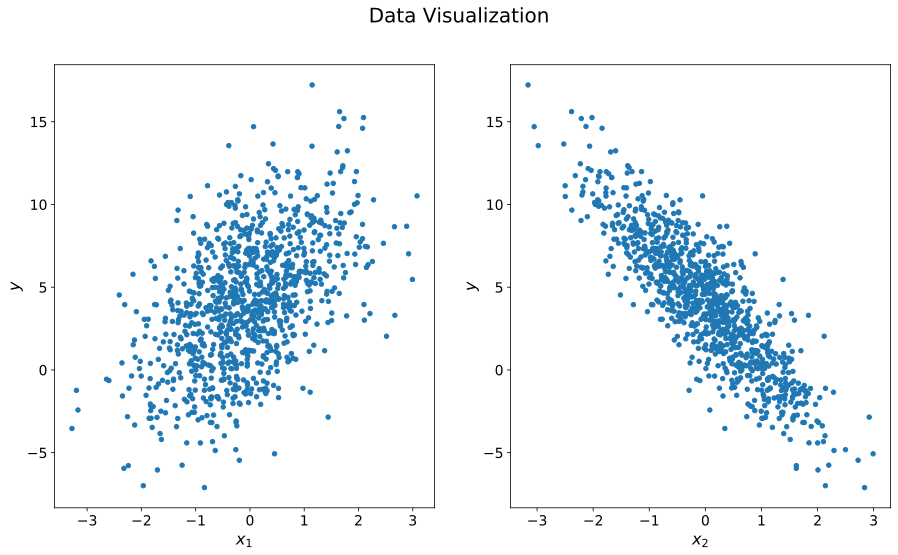
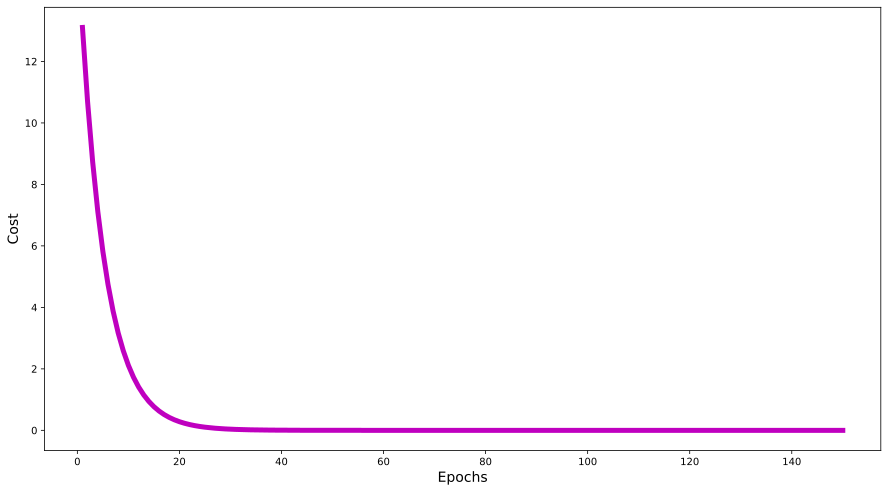
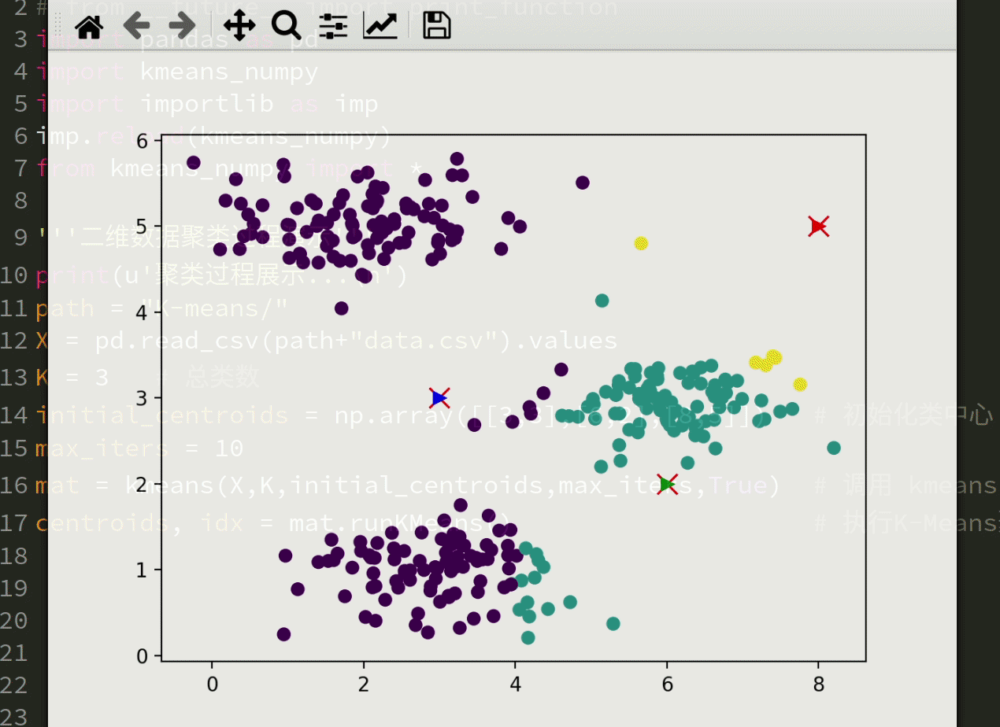

# Machine Learning Note

- [Machine Learning Note](#machine-learning-note)
- [机器学习](#机器学习)
  - [线性回归](#线性回归)
    - [多项式回归](#多项式回归)
  - [逻辑回归](#逻辑回归)
  - [支持向量机](#支持向量机)
  - [k 均值聚类](#k-均值聚类)
- [工具](#工具)
  - [NumPy](#numpy)
  - [Git](#git)

# 机器学习

##  线性回归

[什么是线性回归](./LinearRegression/linearRegression.ipynb)

### 多项式回归

[博文链接](https://matnoble.me/ai/ml/regression/)

## 逻辑回归

[什么是逻辑回归](./LogisticRegression/logisticRegression.ipynb)

## 支持向量机

[SVM 知识](https://github.com/MatNoble/MachineLearningNote/blob/main/svm/svm_basic.ipynb)

[colab 代码](https://colab.research.google.com/drive/1vEjBg5WRxwWjSZOEjFrJarimdbMIdMhr?usp=sharing)

## k 均值聚类

# 工具

## NumPy

[NumPy](https://nbviewer.jupyter.org/github/MatNoble/MachineLearningNote/blob/main/NumPyNotes/NumpyLN.ipynb)

## Git

[Git](https://matnoble.me/tech/programming/git/)